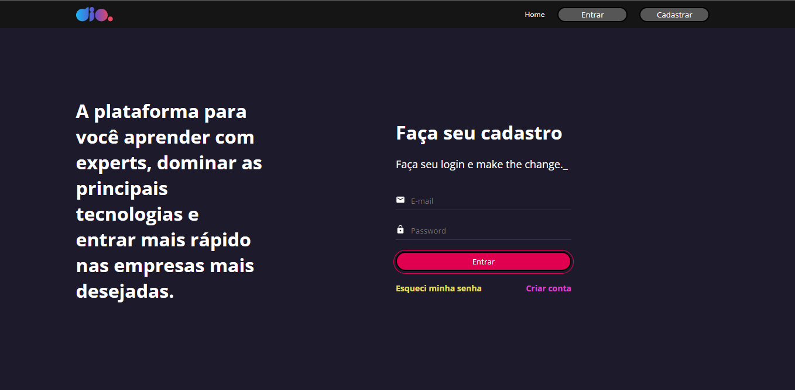
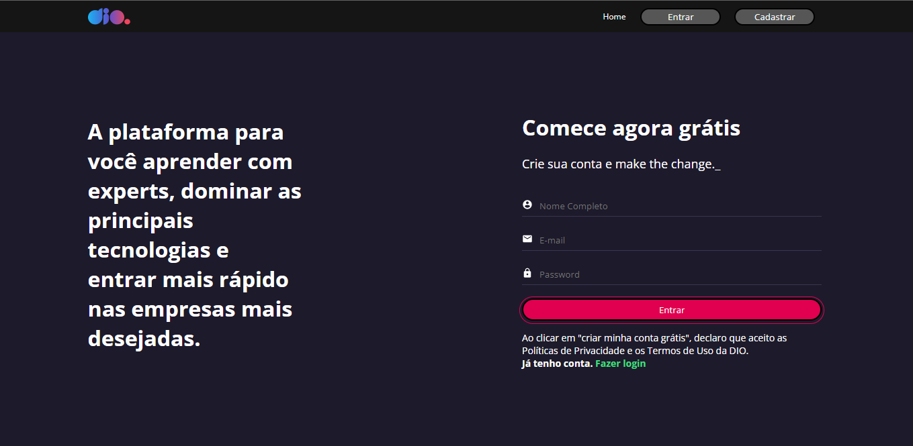
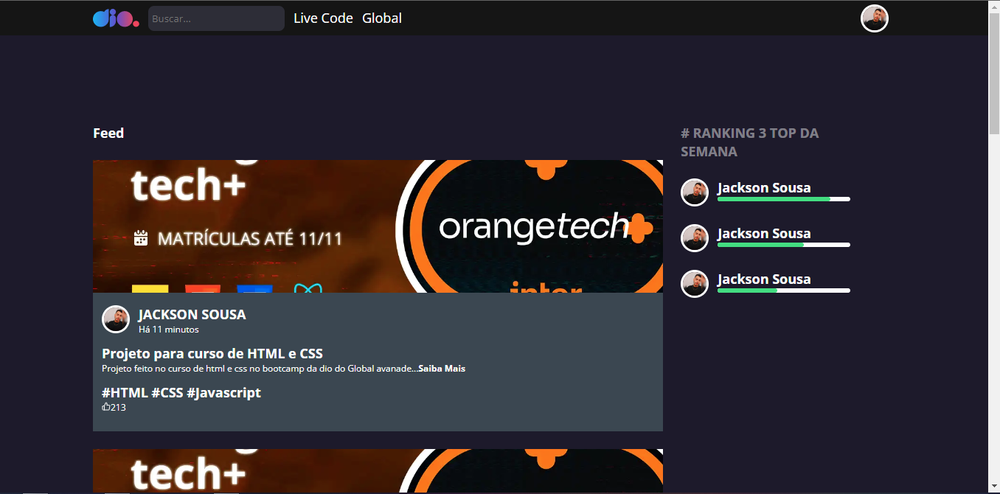

# Clone-Dio

PT-BR/

O projeto de clonar o site da plataforma DIO teve como objetivo colocar em prática tudo o que foi ensinado durante o módulo "Ampliando o Conhecimento em React" do curso de React.

O projeto teve como base o design abaixo, criado no figma:

- figma.com/file/fvjQQNtqaUdpuNixvCZVav/DIO-CLONE?node-id=0%3A1

Nele foi utilizado os conhecimentos adquiridos de React CLI, estilização com styled-components, Hooks e Formulários, o que faz dele um projeto funcional, embora não haja uma database para armazenar os registros na plataforma e nem uma função ativa que faça esses envios de dados. Mais uma vez foi colocado em prática a utilização de componentes para a criação de todo o projeto, tendo como objetivo a praticidade e priorizando o desempenho.

